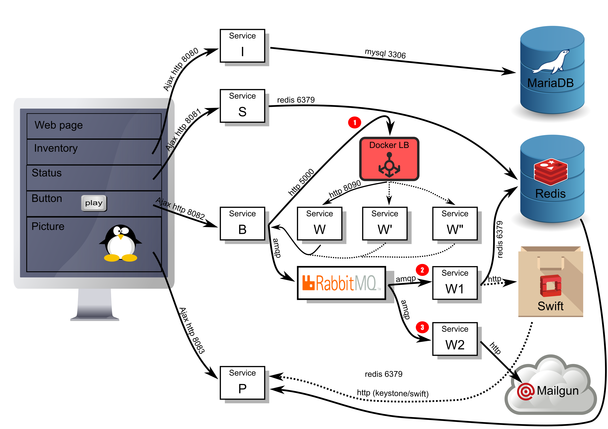

Cloud Native Application
========================

This document purpose is to describe the Cloud Native Application training described below and which is in particular delivered to ENSIMAG IS students in 2017 and 2018.

Document writers:

 * Bruno.Cornec@hpe.com
 * Christophe.Larsonneur@dxc.com
 * Vincent.Misson@hpe.com
 * Rene.Ribaud@dxc.com

# Overview of the Assessment

## Objectives

The goal of this document is to describe the use case that will be used
for the training of ENSIMAG students

## Reference documents

The main OpenStack entry point is at http://www.openstack.org

 * v1.0:	2016-09-29 - First version
 * v1.1:	2016-11-28 - Update with grade per part
 * v1.2:	2017-01-16 - Update with evaluation method
 * v2.0:	2017-09-25 - More focus on the DevOps life-cycle
 * v2.1:	2017-10-20 - Review to match 2017 expectations

# Project Story

You are in a company which achieved an aggressive deal with a Customer
to leverage an open source cloud native application and use it internally
for their customers.

With a new team, you are in charge to deliver and maintain
the application in production in your new customer environment.

The customer gave you 4 major objectives:
 - The application is an open source cloud native application:
    lottery for an e-commerce site
 - The customer requires the production environment to be Openstack cloud based.
     The customer won't install or maintain it. This will be one of your tasks.
 - Any feature/bug request must be in production quickly, with control &
    quality.
 - You will have 7 weeks to deliver the application on the customer Hardware.
   Before that date, the environment won't be considered as production
   and can be re-built from scratch, anytime. Just contact the customer
   to do it.

The Customer will give you 2 servers pre-installed with CentOS 7, to deliver
the application in production.

Your company gives you an access to a reference OpenStack setup hosting a tenant
to develop your environment (factory).

## Objectives

The goal of this training is to build a software factory to do:
- Continuous Improvement
- Continuous Testing
- Continuous Integration
- Continuous Deployment of a cloud native application

Co-related goals are:
- Ensure security
- Improve team work


## Goals & constraints

### Goals

To answer to customer need, your team choose to use the **DevOps**
method/approach/best practices to deploy and maintain this application
in production in the customer company HW.

As a consequence, practitioners will first have to:
 * Organize the team to work using DevOps best practices.
 * Automate the management of a virtual infrastructure (Infrastructure
    as code concept). Your customer requires the use/usage of Openstack as
    an Infrastructure as a Service platform (IaaS)
 * Define and implement a CICD pipeline to easily test and deploy the
    application to a staging area then to production.
 * Put in place tooling to share/track application changes between team
    members/customers.
 * Ensure correct level of security within the factory. (no private keys
    or data available publicly, user access restriction, ports filtering...)

### Constraints
 * Application should only expose http\[s] (ports 80 and 443) to the external network.
 * All materials should be kept on public git repository (github, gitlab,
    framasoft e.g.) with an Open Source license (Cf: https://opensource.org/licenses
    prefer the popular ones). Please note that your git history should
    reflect changes to the factory/infrastructure/application. Also, you
    should commit properly with your personal credentials (email
    preferred) with a unique account.
 * There is no restriction regarding the tools to implement the pipeline.
  It could be external services and/or on premise tools. However, be
  prepared to justify some choices.

## Bonus goals
 * Put in place monitoring to ensure applications are working as expected.
 * Put in place name resolution.
 * Improve applications.
 * Optimize testing duration.
 * Communication dashboard about applications health to users.
 * Performance improvement of your application by scaling services.
 * Applications reliability.
 * Contribute back to the Open Source project

# Application information

## Application schema



## Application description

 * 1 Web + reverse proxy provides a page with 5 visible parts/micro-services: I, S, B, W and P.
 * I(dentification) service: receives http request from customer (link with customer ID) and look for it into DB.
 * S(tatus) service: detect whether customer already played or not, status stored in the DB.
 * B(utton) service: button widget allowing the customer to play. Only when not already done.
 * W(orker) service that computes whether the customer won or not, called by B. If won, post an image representing what has been won into OpenStack Swift or Redis with customer ID. Then post by e-mail via an external provider a message to admins using a message bus. This service is povided by a 3rd party, so it can not be changed. As this service is really slow, scaling it should be considered.
 * P(icture) service: Look into Swift or Redis with customer ID to display the image of the customer, empty if no image.
 * Redis or Swift can be used to store data.
 * Rabbitmq is used to pass message from service B to service W1 and W2.
 * W1 services that listen on the messaging bus and write to the database.
 * W2 services that listen on the messaging bus and send http requests to mailgun external services.

## Application materials (code, doc etc...)
Here is the url of the Open Source project:
https://github.com/uggla/cloud_native_app


## Deliverables

 * On Github:
   * Pipeline design documents and code
   * Application code
   * Infrastructure code (Heat template/ansible playbooks/scripts).

 * Your software factory should be ready to deliver a patch or a feature
    requested by your customer.
    This delivery will be in production during the exam.
    The feature or fix requested can come from the upstream Open Source
    project.

 * As a backup, a video that will present the CICD of the application in
    a new empty tenant and a customer patch to show the factory end to end.


*Note*: A complex feature or bug fix could be delivered several times,
improving the application between each delivery. Your customer does not
require this to be delivered just once. They prefer to see changes frequently.
  But the overall application service must not be impacted by such update.

  In the context of this training, no complex feature or bug fix will be
  requested by your teachers.

*Another Note*: github is mandatory for the delivery. However, you can
use any other scm solutions to meet your needs. But you must update
regularly the github repo with **history**

## Teachers interaction with students


### Platforms

Teachers will provide a remote access (though VPN) to :

* the *customer production platform* (known as *Production environment*)
    (2 servers pre-installed with a CentOS 7 distribution)

    Your development team will have to setup them with (packstack)[https://www.rdoproject.org/install/packstack/.

    Your development team will deploy the customer application and application
    health control on it.

* a runnable *company Openstack tenant* (known as *Reference environment*)
    to install your software factory.
    In this factory, you will be able to
    * develop anything requested by your customers, or proposed by your team
        for improvement/bug fix.
    * test your application and his delivery
    * control the application and software factory health


### Roles

Your teachers will take and behave with 2 different roles:

- *Customer representative*.
    He will support the 2 Production systems that you will use to deliver
    your application.
    <br>to contact your customer, use the mailing list :
    ensimag-customer@lists.osp.hpe.com

- *Your company IT* who hosts your openstack tenant.
    <br>To contact your company IT team, use the mailing list:
    ensimag-internal@lists.osp.hpe.com

When you contact *your customer* or *your company*, remind your group number.

### Training support

Outside of these roles that your teachers will have, you can get support on
the overall training subject, by mail or during the different sessions, to:
* Ask question,
* Get help (VPN Access, platform setup, expertise)
* Discuss

The mailing list is:  ensimag-discuss@lists.osp.hpe.com

# Agenda

Each session is 3 hours long

## First session

 * Project explanation: Overall Goals & method (groups, prod platform, TD systems for tests). No formal solution will be directly given, students will have to build the solution by themselves. Many approaches are possible.  The teachers team role will be after the 2 first sessions and generic presentations on all concepts to help them in the realization of that application and its setup. (Christophe / René)
 * OpenStack architecture & example (Bruno)
 * Docker (Bruno)
 * *Company Openstack tenant* (known as Reference Environment) platform
    explanation (Vincent)
 * OpenVPN setup
 * Waystation creation (see below)  --> pb need group defined.
 * Home work:
   * Continue to explore OpenStack from both UI & CLI
   * Explore tools to use for the factory and automation systems
   * Create 9 groups of 5 students (one country per group), assign specialization (ops, devs, middleware, ... + backup), tool choice left to students, but licensing should be correct (prefer Open Source)

## Second session

 * DevOps fundamentals (Christophe)
 * Application overview (René)
 * Infrastructure as Code: OpenStack API as TD
 * Project explanation: Architecture of the use case - Specifications - Design Constraints & Goals (GitHub, automation, )
 * Home work: Continue to explore OpenStack API (Dev), DevOps concept and tools, Start Prod Infra setup

## Third session

* Team member role and responsibility. Assigning tasks... Who does what?
    The customer like to see that...
* Design and implement a flow to develop and deliver application architecture
* Prod infra setup continued: Ability to launch a VM from an image using a heat template, attached to a network and a storage, and an object storage. private and public net are available and a floating IP attached to the VM.
* Application architecture done: microservices identified, HA solved, Scalability solved. Design done (Paper work, UML ?).

## Fourth session

 * Prod infra setup finished: Ability to launch a VM from an image using a heat template, attached to a network and a storage, and an object storage. private and public net are available and a floating IP attached to the VM.
 * Application architecture development ongoing
 * Factory improvement to deliver fisrt version of the application ecosystem

## Fifth session

 * Prod infra setup / factory review if needed
 * Application ecosystem and software factory improved to deliver more.

## Sixth session

 * Application ecosystem continuous improvement.

## Seventh session

 * Synthesis and integration
 * Group Presentation
 * Integrate a customer request (feature or bug fix) in the factory

## Eigth session

 * Evaluation of the projects

# Evaluation

Evaluation will be 25' Maximum per group including 5' for Q&A.
You will present :
- application ecosystem architecture
- factory architecture
- your roles,
- tasks done,
- code, commits,
- Factory flow from development to deployment
- Process used and description (how you work together)

Then, the functional evaluation will be done on architecture with
explanation of choices, methods and tools used.

 * Reminder: Plan to have a backup video.
 * A presentation to explain the major steps and choices might be useful,
    but not mandatory

Send all deliverable planned in advance of the evaluation (before 7th session)
to allow time for teachers to look at them. Think to provide access if
your project is not public.

| Points | Topic to evaluate |
| ------ | ----------------- |
| **5**  | **Dev team**<br><ul><li>On Gihub:</li><ul><li>Automation code to test and deploy</li><li>Performance and tests results</li><li>Application code</li></ul><li>Application design document</li><li>Present the automatic deployment of the application in a tenant and make reliability checks.</li></ul>|
| **5**  | **Factory (Ops) team**<br><ul><li>Available</li><li>Operational</li><li>With the mandatory components (Agile/CI/CD/...)</li><li>And optional ones needed by the development teams</li><li>On Gihub:</li><ul><li>Heat templates/ansible playbooks/scripts for Infra group</li></ul>|
| **5**  | **Production services**<br><ul><li>Production IaaS up and running based en packstack</li><li>Application still working, independently<br>Support for failure and scalability</li><li>Self healing</li><li>Monitoring</li></ul> |
| **5**  | **Project life**<br><ul><li>Improvement/bug fix timeline from dev to prod</li><li>Agile project plan</li><li>ChatOps, Issue tracking, support</li><li>Upstream relationship</li></ul> |


# How to create your bastion vm on Reference environment

## Connection :

1. Connect using OpenVPN.
The lab network uses 
- HPE Blades, for the production environment
- HPE Moonshot cartridges, for the staging environment

all are located in the HPE Customer Innovation Center and reached through a dedicated VPN.

Each students group will receive a Lab number (X) from the instructors team

All students servers receive their fixed-assigned addresses using a DHCP server. In order to connect to them, a VPN is provided. You need to activate that VPN by launching on Linux the following commands:

```
$ mkdir -p ~/lab
$ cd ~/lab
$ wget ftp://ftp.hpecic.net/pub/openvpn/ca.crt
$ wget ftp://ftp.hpecic.net/pub/openvpn/lab2017.key
$ wget ftp://ftp.hpecic.net/pub/openvpn/lab2017.crt
$ wget ftp://ftp.hpecic.net/pub/openvpn/vpnlab2017.conf
$ sudo openvpn --config vpnlab2017.conf
```

For those of you unlucky using a Windows desktop system, then install first wget from http://labossi.hpintelco.net/win/wget.exe or http://labossi.hpintelco.net/win/wget64.exe and then openvpn in case you don't have it from http://openvpn.net/index.php/open-source/downloads.html (internal mirror at http://labossi.hpintelco.net/win/) 

You need to launch a cmd command as **Administrator** on your system (use the
Start/windows button, type `cmd` and right click on the icon appearing to select
`Run as Administrator`) and then you have to run in it 

```
C:\WINDOWS\SYSTEM32> md C:\openvpn
C:\WINDOWS\SYSTEM32> cd C:\openvpn
```
Download the 4 files previously mentioned in the `wget` command under
`C:\openvpn`. Then issue:

```
C:\openvpn> openvpn --config vpnlab2017.conf
```

For those of you unlucky using a MacOS desktop system, then install a compatible openvpn tool in case you don't have it already from https://code.google.com/p/tunnelblick/. Then launch TunnelBlick using that conf file.

From now on, you should be able to connect using `ssh` to the systems.

For those of you still unlucky using a Windows desktop system, then install
`putty` in case you don't have it from http://www.chiark.greenend.org.uk/~sgtatham/putty/download.html.

Then launch `putty` in the run command interface and log on your target system.

2. Connect to the Openstack Dashboard.
    Reference OpenStack dashboard IP:
3. To log use : http://10.11.50.7/
    * user name : LabX    (X = number of your group)
    * password : The password for your group that you should have received by mail.

At that step, you shoud be connected in your respective tenant (groupeX) with a fresh environment.
You need to create a minimal infrastructure, a bastion server using the dashboard.

This openstack has a lot more services than the one we used in the first session. (note that swift and cinder are not yet available which is a problem only for service P and B)
The neutron network service is available, and you will have to use it to create your networks that will host the bastion server.

## Create a private network:

1. Open the menu and click on network then choose networks subitem.
2. Create a new network.
    * Name : you can use whatever name, but as an example we will use "private"
    * Subnet name : private_subnet
    * Network address : CIDR of your network, you can choose what you want, here as an example we can use 192.168.5.0/24.
    * Gateway IP : by default it will use the first IP of the range
    * In subnet details just provide the DNS : 10.3.156.12

This will be your private network, we will deploy our admin VMs inside that network.
You can see there is another network called external-network. This network is a public one. It will be used to provide access to VM from the outside by mapping a floating ip.
However before that, we need to connect private network and external network with a router.

## Create a router:

1. Open the menu and click on network then choose routers subitem.
2. Create a router
    * Name : router1  (as an example)
    * External network : public
3. Click on the router1 just created and add an interface to the private network.
4. You can verify in "Network Topology" that you have a router in beetween external network and internal one.

Now the networking should be in place.

## Create your bastion (admin) server and access it :

1. Deploy a new vm via the dashboard (launch a new instance)
    * Name: bastion
    * Image: Fedora or Ubuntu (the one you prefer, they have both recent openstack tools)
    * Flavor: v1.m1.d1
    * Network: private1  (not the external)
    * Security group: default
    * Key pair: Generate your keypair or provide your ssh pub key.

2. Associate a floating ip to your server (via compute --> Accès & Sécurité --> IP flottantes)
This is a bit tricky, you need first to allocate a floating ip (this will give you an IP on the external network)
Then you will associate this external ip to your bastion VM on the private network.

Ex : in the instance dashboard you should see in the IP column :
VM name :bastion

    192.168.5.5

Floating IPs:

    10.11.53.15


3. Open the menu and click on compute then choose access and security subitem.
4. Manage the default security group to allow Ingress ssh(port 22)
5. You should be able to log on your vm using the floating ip and the ssh key created before.   (please ask if you need assistance with ssh)
    Ex: ssh fedora@10.11.53.15 or ssh ubuntu@10.11.53.15

6. You can install the openstack client to manage the API and do automation. (assuming there is no errors in the above parts)
Ex: dnf install python-openstackclient    --> this will install a recent version of the openstack client on Fedora
7. Get your openrc files by opening the menu and click on compute then choose access and security subitem and menu API access.
Here you can download a rcfile that will give you all the settings to connect to your environment.
You just need to source that file to export the OS* required environment variables.

Note :
Consider the default security group as your admin subnet. Restrict access to it to only ssh.
Applications should be deployed in their respective networks and corresponding security groups.

Advice 1 : do not create a lot of security groups, you will become crazy managing them. A good approach is to map a security group per network and open the required ports.

Advice 2 : look at the orchestration part and mostly service heat. Sounds like an easy way to deploy stuff although not mandatory.

Advice 3 : using IP is painfull in a cloud environment, prefer names.
